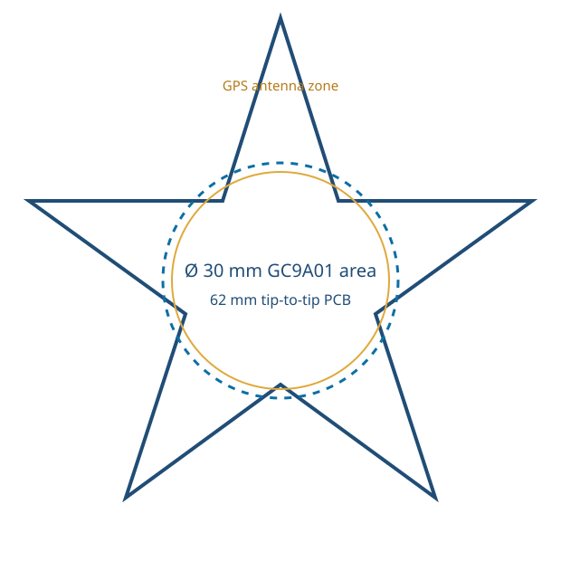

# Star-shaped SkyMap — hardware definition v0.1

## Intended form

A compact five-point star pendant/desk object with a 240×240 round GC9A01 display in the centre. Start with a **62 mm tip-to-tip, two-layer PCB**; this leaves a display-dominant face while keeping enough arm area for the GPS, battery connection, and USB-C edge access.

The GPS antenna must sit at the outermost upper star point, facing the sky. Keep copper, the ESP32-C3, display flex/ground plane, battery, and enclosure metal out of the antenna keep-out described by the selected GPS module datasheet.

## Chosen architecture

`LiPo → protection/charger with power-path → 3.3 V regulator → ESP32-C3 + GC9A01 + GPS`

| Block | PCB requirement |
| --- | --- |
| ESP32-C3 | Use an ESP32-C3-WROOM-02 module, antenna at a board edge with its mandated copper keep-out. Add EN/BOOT buttons and programming pads. |
| Display | GC9A01 240×240, 4-wire SPI at 3.3 V. Use a board-specific FPC/socket or a measured breakout footprint; do not assume both are interchangeable. |
| GPS | UART GPS module with a documented active-antenna or ceramic-patch layout. GPS TX → ESP32 RX is required; GPS RX is optional. |
| LiPo | 1-cell LiPo with JST-SH 1.0 mm connector, reverse-polarity-aware footprint, and a specified battery capacity. |
| Power | USB-C 5 V sink, single-cell charger with power-path/load sharing, protected LiPo input, and a 3.3 V regulator sized for Wi-Fi/display peaks. |

## Proposed custom-PCB pins

| Signal | ESP32-C3 GPIO | Note |
| --- | --- | --- |
| Display SCLK / MOSI / CS / DC / RST | 4 / 6 / 7 / 2 / 3 | Defined in `firmware/skymap_c3/config.h.example`; verify against the final C3 module and boot strapping rules. |
| GPS TX → ESP RX | 20 | Required UART data path. |
| ESP TX → GPS RX | 21 | Optional configuration path. |
| USB-C | native USB pins or USB-UART | Choose one programming method before schematic capture. |

## Required schematic items

- USB-C receptacle, CC pull-downs, ESD protection, and 5 V fuse/current protection.
- A charger/power-path IC selected for the actual LiPo and USB current budget; battery protection if the chosen LiPo does not include it.
- 3.3 V buck-boost or low-dropout regulator selected after peak-current measurement; local decoupling at all ICs and display connector.
- Battery voltage divider to an ADC pin, switched or high-value to minimise idle drain.
- Power switch or load switch, reset, boot, and accessible test pads for 3V3/GND/UART/USB.
- GPS backup supply if the chosen receiver supports it and fast reacquisition matters.

## Gate before PCB/CAD release

Record these exact part numbers and measured dimensions: GC9A01 display/board, GPS module and antenna, ESP32-C3 module/board, LiPo connector and capacity, charger IC, regulator, USB-C connector, and enclosure wall/fastener approach. Then capture schematic, run ERC/DRC, and only then place the star outline and enclosure features.
